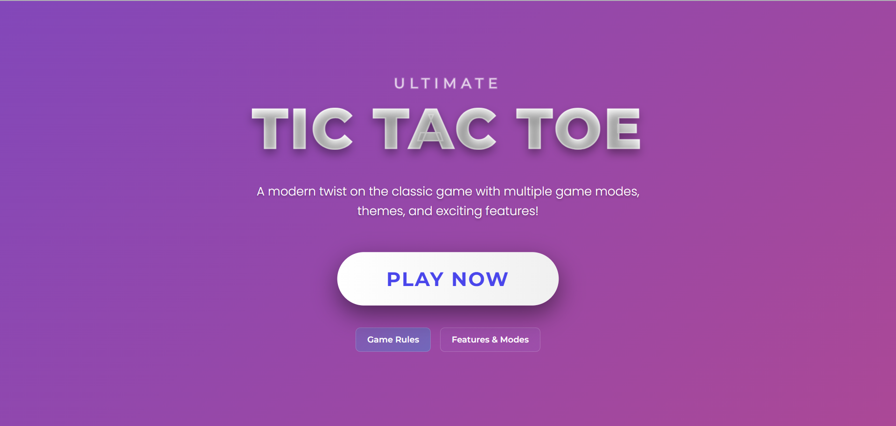

# Tic Tac Toe

A modern, responsive Tic Tac Toe game built with React and TypeScript, featuring multiple game modes, themes, and animations.



## Features

- **Multiple Game Modes**: Play against a friend or challenge the AI with three difficulty levels
- **Beautiful Themes**: Choose between Light, Dark, and Neon themes
- **Responsive Design**: Play on any device with a fully responsive layout
- **Animations & Effects**: Enjoy smooth animations and visual effects throughout the game
- **Game History**: Track your wins, losses, and ties
- **Undo Move**: Made a mistake? Undo your last move

## Getting Started

### Prerequisites

- Node.js 14.0 or later
- npm or yarn

### Installation

1. Clone the repository
```
git clone https://github.com/your-username/tic-tac-toe.git
```

2. Navigate to the project directory
```
cd tic-tac-toe
```

3. Install dependencies
```
npm install
```

4. Start the development server
```
npm run dev
```

5. Open your browser and navigate to `http://localhost:5173`

## How to Play

1. Choose a game mode and theme in the settings menu
2. Players take turns placing their mark (X or O) on the board
3. The first player to get 3 marks in a row (horizontally, vertically, or diagonally) wins
4. If all squares are filled and no player has 3 marks in a row, the game ends in a draw

## Technologies Used

- React
- TypeScript
- Vite
- CSS3

## Deployment

This game is deployed using [GitHub Pages/Vercel/Netlify]. You can play it online at [https://your-deployment-url.com].

## License

This project is licensed under the MIT License - see the LICENSE file for details.

## Acknowledgments

- Special thanks to [your name] for creating this modern version of the classic Tic Tac Toe game
- Inspired by various React game tutorials and examples
